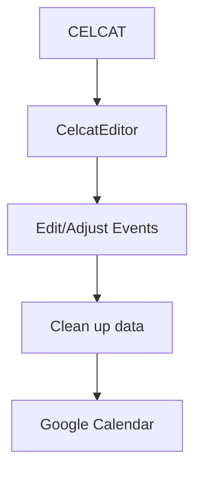

# CelcatEditor

**CelcatEditor** is a personal project designed to make it easier to import and manage a university timetable from **Université de Bordeaux's CELCAT calendar** in **Google Calendar**.
The project aims to bridge the gap between the calendar format provided by the university and the calendar experience I use every day.

> 🚧 **WIP** - This project is being developed primarily for personal use and may change significantly over time.

# Features
* Import events from CELCAT calendar
* Convert CELCAT calendar to my preferred format for Google Calendar
* Edit or adjust events before importing them into Google Calendar
* Designed around the timetable system used at **Université de Bordeaux**, but can be adapted for other institutions with similar calendar formats (however, this is not guaranteed and may require additional work).

# Motivation
Université de Bordeaux provides student timetables through CELCAT. While CELCAT provides calendar export functionality, integrating the resulting calendar into my personal Google Calendar workflow isn't as convenient as I'd like.

CelcatEditor was created to solve that problem by providing a simple way to:

1. Retrieve or import my university timetable.
2. Process the CELCAT calendar data.
3. Modify events when necessary.
4. Import the resulting events into Google Calendar.

The project is mainly a personal tool, but it may be useful to other students who have a similar workflow.

# Tech Stack
> This section will be updated as the project progresses.

Language: TypeScript
Calendar Format: iCalendar (`.ics`)
Target Calendar: Google Calendar
Source: CELCAT (Université de Bordeaux)

# Installation
## Prerequisites
Before you can use CelcatEditor, you need to have the following:
* A CELCAT calendar provided by your university (Université de Bordeaux in this case).
* A Google account to access Google Calendar (or any other calendar service supporting iCalendar format).
* The dependencies required to run the project (to be specified later).

## Installation Steps
1. Clone the repository to your local machine.
```bash
git clone https://github.com/Caranouga/CelcatEditor.git
cd CelcatEditor
```
2. Install the required dependencies (to be specified later).
3. Run the application (to be specified later).

## Usage
> The usage instructions will be provided once the application is ready for use.

The general workflow is expected to be as follows:


# Roadmap
The roadmap for CelcatEditor includes the following milestones:
- [ ] Import `.ics` files from CELCAT
- [ ] Parse and process the calendar data
- [ ] Edit event information
- [ ] Clean up and standardize event data
- [ ] Provide an interface for editing events

This roadmap is subject to change as the project evolves and new requirements emerge.

# Disclaimer
This project is an **unofficial tool** and personal project.
It is not affiliated with or endorsed by **Université de Bordeaux** or **CELCAT**. Use it at your own risk, and always verify the accuracy of the imported events in your Google Calendar.
The project is provided "as-is" without any warranties or guarantees of functionality.

# Contributing
Contributions are welcome! If you would like to contribute to CelcatEditor, please follow these guidelines:
1. Fork the repository and create a new branch for your feature or bug fix.
2. Make your changes and ensure that they are well-documented.
3. Submit a pull request with a clear description of your changes and the problem they solve.

# Acknowledgements
I would like to thank the following individuals and resources for their contributions to this project:
- []

# License
This project is licensed under the MIT License. See the [LICENSE](LICENSE) file for more details.